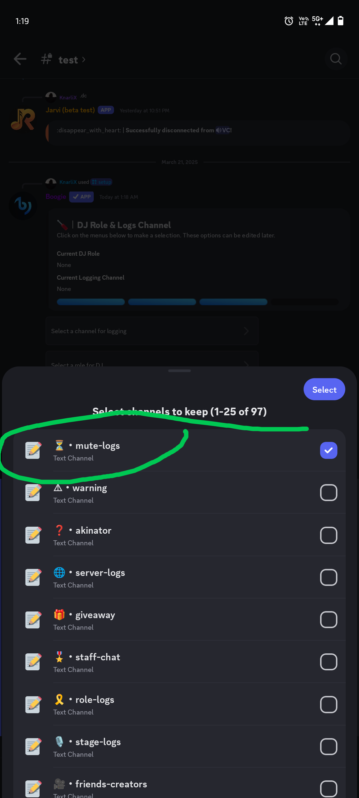
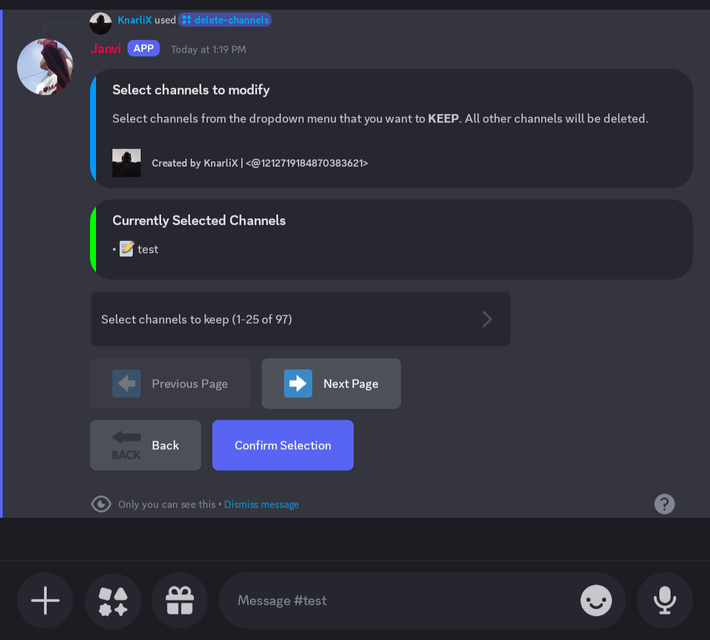
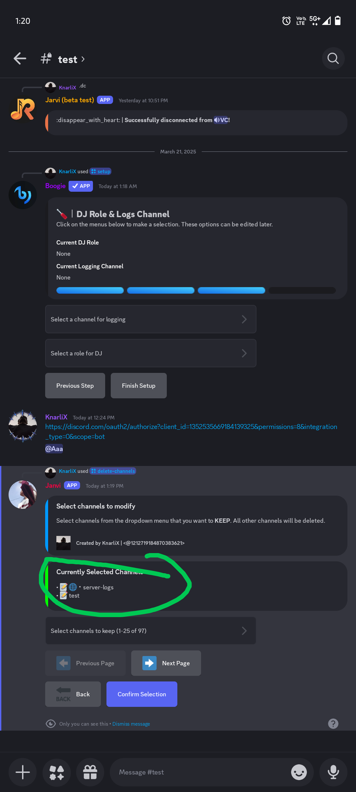

#  KnarliX Channel Manager

<div align="center">
  
  <br>
  <h2>Channel Manager Bot 🤖</h2>
  <p>A powerful Discord bot that revolutionizes channel management for server administrators, providing an efficient solution for organizing and cleaning up Discord servers.</p>
  <br>
  
  [](https://discord.js.org)
  [](https://www.typescriptlang.org/)
  [](https://nodejs.org/)
  [](LICENSE)
  
  <br>
  
  <br><br>
  <p>
    <b>Designed & Developed by</b>
    <br>
    <a href="https://github.com/KnarliX">
      
    </a>
    <br>
    <b>KnarliX</b>
  </p>
</div>

## ✨ Features

<div class="features-container">
  <div class="feature-card">
    <div class="feature-icon">🗑️</div>
    <div class="feature-content">
      <h3>Bulk Channel Deletion</h3>
      <p>Select which channels to keep and delete the rest in one operation, perfect for server cleanup</p>
    </div>
  </div>
  
  <div class="feature-card">
    <div class="feature-icon">📋</div>
    <div class="feature-content">
      <h3>Multi-Type Support</h3>
      <p>Works with all channel types including text, voice, categories, forums, and announcements</p>
    </div>
  </div>
  
  <div class="feature-card">
    <div class="feature-icon">🔄</div>
    <div class="feature-content">
      <h3>Persistent Selections</h3>
      <p>Channel selections are saved as you work and persist between navigation</p>
    </div>
  </div>
  
  <div class="feature-card">
    <div class="feature-icon">📱</div>
    <div class="feature-content">
      <h3>Mobile Compatible</h3>
      <p>Works perfectly on Discord mobile - manage your server from anywhere</p>
    </div>
  </div>
  
  <div class="feature-card">
    <div class="feature-icon">👥</div>
    <div class="feature-content">
      <h3>Administrator Only</h3>
      <p>Commands are restricted to users with administrator permissions for security</p>
    </div>
  </div>
  
  <div class="feature-card">
    <div class="feature-icon">🚀</div>
    <div class="feature-content">
      <h3>Optimized Performance</h3>
      <p>Fast operations even on servers with hundreds of channels</p>
    </div>
  </div>
  
  <div class="feature-card">
    <div class="feature-icon">📊</div>
    <div class="feature-content">
      <h3>Activity Logging</h3>
      <p>Detailed operation logs to track all channel management activities</p>
    </div>
  </div>
  
  <div class="feature-card">
    <div class="feature-icon">🌈</div>
    <div class="feature-content">
      <h3>Intuitive UI</h3>
      <p>User-friendly interface with clear visual indicators and type filtering</p>
    </div>
  </div>
</div>

<style>
.features-container {
  display: flex;
  flex-wrap: wrap;
  gap: 1rem;
  justify-content: center;
}

.feature-card {
  display: flex;
  align-items: flex-start;
  background: #f8f9fa;
  border-radius: 8px;
  padding: 1rem;
  width: calc(50% - 1rem);
  box-shadow: 0 2px 5px rgba(0,0,0,0.1);
  transition: transform 0.3s ease, box-shadow 0.3s ease;
}

.feature-card:hover {
  transform: translateY(-5px);
  box-shadow: 0 5px 15px rgba(0,0,0,0.1);
}

.feature-icon {
  font-size: 2rem;
  margin-right: 1rem;
  min-width: 2.5rem;
  text-align: center;
}

.feature-content h3 {
  margin-top: 0;
  margin-bottom: 0.5rem;
  color: #5865F2;
}

.feature-content p {
  margin: 0;
  color: #4f5660;
}

@media (max-width: 768px) {
  .feature-card {
    width: 100%;
  }
}
</style>

## 📸 Screenshots

<div align="center">
  
  
  <br><br>
  
  
</div>

## 🛠️ Technology Stack

| Backend | Tools |
|---------|-------|
| Node.js | Git |
| TypeScript | npm |
| Express | ESLint |
| Discord.js | TypeScript |
| Drizzle ORM | |

## 📋 Installation & Setup

### Prerequisites
- Node.js 18+
- npm or yarn
- A Discord account with a registered application and bot

### Step 1: Clone the Repository
```bash
git clone https://github.com/knarlix/discord-channel-manager.git
cd discord-channel-manager
```

### Step 2: Install Dependencies
```bash
npm install
```

### Step 3: Configure Environment
Create a `.env` file in the project root with:
```
DISCORD_BOT_TOKEN="your_discord_bot_token_here"
```

### Step 4: Start the Application
```bash
npm run dev
```

## 📚 Usage Guide

### Adding the Bot to Your Server

1. Go to the [Discord Developer Portal](https://discord.com/developers/applications)
2. Select your application and navigate to the "OAuth2" tab
3. Under "Scopes" select "bot" and under "Bot Permissions" select:
   - Manage Channels
   - Read Messages/View Channels
   - Send Messages
4. Copy the generated URL and open it in your browser to add the bot to your server

### Using the Bot Commands

The bot provides a slash command:

- `/delete-channels` - Opens an interactive interface to select channels to keep, while all unselected channels will be deleted

## 🔒 Security

- The bot only requires the minimum necessary permissions to function
- All operations are logged and can be audited
- Only server administrators can use destructive commands

## 🚀 Deployment

This project can be deployed on any Node.js hosting platform:

1. **Replit**: Use Replit to host your bot 24/7
2. **Railway**: Deploy with one-click using the Railway platform
3. **VPS/Dedicated Server**: Host on any server running Node.js

## 🌐 Website

A companion website for the bot is available in the root directory. You can host it on GitHub Pages:

1. Fork this repository
2. Go to repository Settings → Pages
3. Set the source to "main" branch and folder to "/"
4. Your website will be available at `https://yourusername.github.io/discord-channel-manager`

The website provides detailed information about the bot, usage instructions, and setup guides.

## 📂 GitHub Repository Setup

To push your code to GitHub:

1. **Create a GitHub Repository**:
   - Go to [GitHub](https://github.com) and log in
   - Click "New repository" and name it `discord-channel-manager`
   - Keep it public or private based on your preference
   - Do not initialize with README, .gitignore, or license (we already have these)

2. **Initialize Git and Push (First Time)**:
   ```bash
   # Make sure you're in the project directory
   git init
   git add .
   git commit -m "Initial commit: Discord Channel Manager Bot"
   git branch -M main
   git remote add origin https://github.com/yourusername/discord-channel-manager.git
   git push -u origin main
   ```

3. **For Subsequent Updates**:
   ```bash
   git add .
   git commit -m "Your update message here"
   git push
   ```

4. **Files to Exclude**:
   - The `.gitignore` file already excludes:
     - `node_modules/`
     - `.env` (contains your bot token)
     - Various cache and log files
   - Never commit your Discord bot token to GitHub!

## 🙋 FAQ

### Is the bot free to use?
Yes, the bot is completely free and open source.

### Can I customize the bot?
Absolutely! The code is open-source and can be modified to suit your needs.

### How many channels can the bot manage?
The bot is designed to handle servers with hundreds of channels efficiently.

## 📝 License

This project is licensed under the MIT License - see the [LICENSE](LICENSE) file for details.

## 🙏 Credits

<div align="center">
  <div class="creator-card">
    
    <h3>KnarliX</h3>
    <p>Lead Developer & Designer</p>
    <div class="social-links">
      <a href="https://github.com/KnarliX" title="GitHub"></a>
      <a href="https://discord.com/users/1212719184870383621" title="Discord"></a>
      <a href="https://youtube.com/@KnarliX" title="YouTube"></a>
      <a href="https://instagram.com/KnarliX" title="Instagram"></a>
    </div>
  </div>
</div>

<style>
.creator-card {
  display: flex;
  flex-direction: column;
  align-items: center;
  background-color: #ffffff;
  border-radius: 16px;
  padding: 2rem;
  box-shadow: 0 8px 24px rgba(0,0,0,0.12);
  max-width: 400px;
  margin: 0 auto;
}

.creator-image {
  width: 150px;
  height: 150px;
  border-radius: 50%;
  object-fit: cover;
  border: 5px solid #5865F2;
  margin-bottom: 1rem;
}

.creator-card h3 {
  margin: 0.5rem 0;
  font-size: 1.8rem;
  color: #23272A;
}

.creator-card p {
  margin: 0.25rem 0 1.5rem 0;
  color: #5865F2;
  font-weight: 500;
}

.social-links {
  display: flex;
  gap: 0.5rem;
  flex-wrap: wrap;
  justify-content: center;
}

.social-links a {
  text-decoration: none;
}
</style>

---

<p align="center">Made with ❤️ and TypeScript</p>