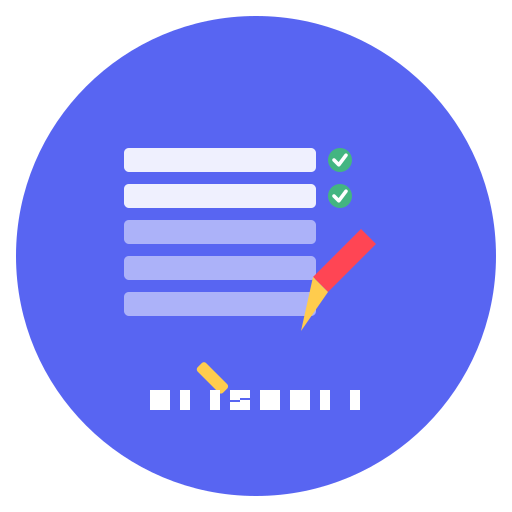

#  Discord Channel Deleter Bot

<div align="center">
  
  <br>
  <h2>Discord Channel Deleter Bot</h2>
  <p>A powerful Discord bot that revolutionizes channel management for server administrators, providing an efficient solution for organizing and cleaning up Discord servers.</p>
  <br>
  
  [](https://discord.js.org)
  [](https://www.typescriptlang.org/)
  [](https://nodejs.org/)
  [](LICENSE)
  
  <br>
  
  <br><br>
  <p>
    <b>Designed & Developed by</b>
    <br>
    <a href="https://github.com/KnarliX">
      
    </a>
    <br>
    <b>KnarliX</b>
  </p>
</div>

## ✨ Features

### Key Features

- 🗑️ **Bulk Channel Deletion** - Select which channels to keep and delete the rest in one operation, perfect for server cleanup
- 👑 **Role Cleanup** - Select which roles to keep and delete all others to streamline server permissions
- ✏️ **Message Clearing** - Quickly clear up to 100 messages at once from any channel with proper permission checks
- 📋 **Multi-Type Support** - Works with all channel types including text, voice, categories, forums, and announcements
- 🔄 **Persistent Selections** - Selections are saved as you work and persist between navigation
- 📱 **Mobile Compatible** - Works perfectly on Discord mobile - manage your server from anywhere
- 👥 **Administrator Only** - Commands are restricted to users with administrator permissions for security
- 🚀 **Optimized Performance** - Fast operations even on servers with hundreds of channels or roles
- 📊 **Activity Logging** - Detailed operation logs to track all management activities
- 🌈 **Intuitive UI** - User-friendly interface with clear visual indicators and filtering options

## 📸 Screenshots

<div align="center">
 
  
  <br><br>
  
   
</div>

## 🛠️ Technology Stack

| Backend | Tools |
|---------|-------|
| Node.js | Git |
| TypeScript | npm |
| Express | ESLint |
| Discord.js | TypeScript |
| Drizzle ORM | |

## 📋 Installation & Setup

### Prerequisites
- Node.js 18+
- npm or yarn
- A Discord account with a registered application and bot

### Step 1: Clone the Repository
```bash
git clone https://github.com/knarlix/discord-channel-deleter-bot.git
cd discord-channel-deleter-bot
```

### Step 2: Install Dependencies
```bash
npm install
```

### Step 3: Configure Environment
Create a `.env` file in the project root with:
```
DISCORD_BOT_TOKEN="your_discord_bot_token_here"
```

### Step 4: Start the Application
```bash
npm run dev
```

## 📚 Usage Guide

### Adding the Bot to Your Server

1. Go to the [Discord Developer Portal](https://discord.com/developers/applications)
2. Select your application and navigate to the "OAuth2" tab
3. Under "Scopes" select "bot" and under "Bot Permissions" select:
   - Manage Channels
   - Manage Roles
   - Read Messages/View Channels
   - Send Messages
   - Manage Messages
4. Copy the generated URL and open it in your browser to add the bot to your server

### Using the Bot Commands

The bot provides the following slash commands:

- `/delete-channels` - Opens an interactive interface to select channels to keep, while all unselected channels will be deleted
- `/delete-roles` - Opens an interactive interface to select roles to keep, while all unselected roles will be deleted
- `/clear` - Clears messages from a channel with powerful filtering options:
  - `amount` - Number of messages to delete (1-100)
  - `type` - Filter by message type (all, user messages only, or bot messages only)
  - `from` - Delete messages only from a specific user

## 🔒 Security

- The bot only requires the minimum necessary permissions to function
- All operations are logged and can be audited
- Only server administrators can use destructive commands

## 🚀 Deployment

This project can be deployed on any Node.js hosting platform:

1. **Replit**: Use Replit to host your bot 24/7 (recommended with UptimeRobot for continuous uptime)
2. **Railway**: Deploy with one-click using the Railway platform
3. **VPS/Dedicated Server**: Host on any server running Node.js

### Setting Up UptimeRobot for 24/7 Uptime

To keep your bot running 24/7 on free hosting platforms like Replit, follow these steps:

1. **Create an UptimeRobot Account**:
   - Go to [UptimeRobot](https://uptimerobot.com) and sign up for a free account

2. **Add a New Monitor**:
   - Click "Add New Monitor"
   - Select "HTTP(s)" as the monitor type
   - Enter a friendly name like "Discord Channel Deleter Bot"
   - Enter your bot's URL (e.g., `https://your-replit-project.username.repl.co`)
   - Set the monitoring interval to 5 minutes
   - Click "Create Monitor"

3. **Verify Setup**:
   - The bot now has a dedicated HTTP endpoint at the root URL (`/`) that responds to UptimeRobot's pings
   - A health check endpoint is available at `/health` for detailed status monitoring
   - UptimeRobot will ping your bot at regular intervals, preventing it from going into sleep mode

This setup ensures your bot remains online even when using free hosting services that normally sleep after periods of inactivity.

## 🙋 FAQ

### Is the bot free to use?
Yes, the bot is completely free and open source.

### Can I customize the bot?
Absolutely! The code is open-source and can be modified to suit your needs.

### How many channels can the bot manage?
The bot is designed to handle servers with hundreds of channels efficiently.

### What can I do if the bot is offline?
If the bot appears offline, you can deploy your own instance using the setup instructions in this README. The bot is designed to run on any Node.js hosting platform including Replit, Railway, or your own server.

## 📝 License

This project is licensed under the MIT License - see the [LICENSE](LICENSE) file for details.

## 🙏 Credits

<div align="center">
  
  <h3>KnarliX</h3>
  <p>Lead Developer & Designer</p>
  <p>
    <a href="https://github.com/KnarliX" title="GitHub"></a>
    <a href="https://discord.com/users/1212719184870383621" title="Discord"></a>
    <a href="https://youtube.com/@KnarliX" title="YouTube"></a>
    <a href="https://instagram.com/KnarliX" title="Instagram"></a>
  </p>
</div>

---

<p align="center">Made with ❤️ and TypeScript</p>